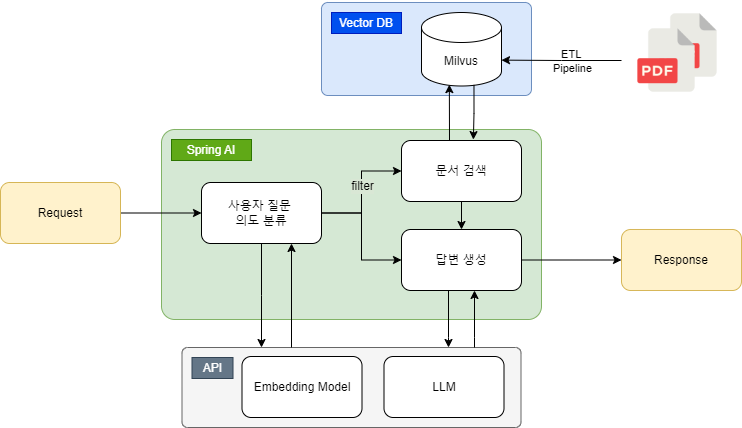
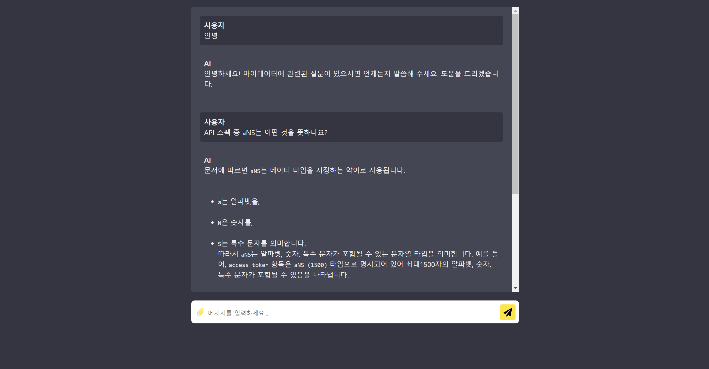

# 🌿Spring AI를 활용한 AI Agent🌿
Spring AI를 사용하여 Vector DB에 임베딩한 문서 기반으로 답변해주는 AI Agent입니다.

## 👩‍💻Tech Stack


## 💡Service Flow

- TikaDocumentReader와 TextSplitter를 사용해 문서의 텍스트를 추출하고 Vector DB에 임베딩하였습니다.
- Embedding Model은 OpenAI의 text-embedding-3-small을 사용하였습니다.
- Chat Model은 OpenAI의 gpt-4o를 사용하였습니다.
- milvus의 index-type은 IVF_FLAT, metric-type은 COSINE을 사용하였습니다.
- 문서 검색시 사용자의 의도 분류에 따라 선택하여 검색하였습니다.
- UUID를 통해 멀티턴이 가능하도록 구현하였습니다.

## ✅Project 실행방법
1. application.properties 파일에 OPENAI_API_KEY 를 설정합니다.
   ```
   spring.ai.openai.api-key=${OPENAI_API_KEY}
   ```

2. Milvus DB에는 이미 임베딩이 되어있습니다. 만약, 직접 Milvus DB를 설정하고 싶으시면 다음 Milvus 설정을 변경하면 됩니다.
   ```
   spring.ai.vectorstore.milvus.client.host=${MILVUS_IP}
   spring.ai.vectorstore.milvus.client.port=${MILVUS_PORT}
   ```
3. 프로젝트를 실행시킨 후 다음 url로 접근하면 AI Agent와 채팅이 가능합니다.
    - http://localhost:8080/chat


## 💡API Information
- [POST] /ai/chat/stream/my-data : 문서 기반 멀티턴 대화 기능
- [POST] /ai/embedding/my-data : 문서 임베딩 기능 (프로젝트 내 첨부된 문서를 임베딩하도록 되어있습니다.)

## ✨Example


## 🤍이슈와 해결방안
### 1. TikaDocumentReader
- 이슈사항) Spring AI의 1.0.0-M1에서 제공하는 TikaDocumentReader 의 get() 메서드가 동작하지 않았습니다.
- 해결방법) Spring AI github의 main 브랜치에는 버전에 바뀌어 있어 해당 버전을 직접 설정하였습니다.
   ```
   implementation 'org.apache.tika:tika-core:3.0.0-BETA'
   implementation 'org.apache.tika:tika-parsers-standard-package:3.0.0-BETA'
   ```
- 참고자료) https://github.com/spring-projects/spring-ai/commit/237feb3437dbd55f088031775631111aebfb0f8a
### 2. Milvus 다중 컬렉션
- 이슈사항) Spring AI에서 아직 Milvus의 다중 컬렉션 지원이 되지 않았습니다.
- 해결방법) 검색하려는 두 개의 문서는 특징이 달라 다른 컬렉션으로 구성해 사용자 의도를 분석하고 그 결과에 따라 검색하도록 구현하려고 하였습니다. 그러나, 다중 컬렉션을 사용할 수 없어 사용자의 의도를 분석 후 해당하는 문서 정보를 meta 정보에서 필터링하여 검색하도록 구현하였습니다.
- 참고자료) https://github.com/spring-projects/spring-ai/issues/468
### 3. stream() 사용 시 글자 유실
- 이슈사항) Spring AI에서 지원해주는 기능인 Flux를 통해 LLM의 답변을 받아 SSE로 구현하였습니다. 그러나, 글자가 유실되는 현상이 있었고, Spring AI github의 issue에 해당 문제가 제기되어 있는 것을 확인하였습니다.
- 해결방법) 스트림으로 구현하지 않고 답변 전체를 생성후 답변이 나가도록 하였으며, 그 사이 화면에는 로딩이 보여지도록 하였습니다. Spring AI의 M2 버전에 적용될 것으로 보여 이후에 적용 가능할 것으로 보입니다.
- 참고자료) https://github.com/spring-projects/spring-ai/issues/876

## 🤍TO DO LIST
- Spring AI의 버전 업데이트 이후 SSE 적용
- 이미지 입력을 통한 문서 검색과 이미지로 정리되어 보여주는 멀티모달 구현
- 모델 토큰 제한 해결 : OpenAI 응답 결과 'finish_reason'이 'length' 일 경우 화면에 이어서 생성하기 버튼이 나타나도록 하고 버튼 클릭 시 user message에 직전 LLM 답변을 넣은 후 문장을 이어서 생성하도록 요청하는 프롬프트를 사용하여 답변이 끝까지 작성될 수 있도록 수정
- 답변 생성 결과를 검증하는 프로세스 추가